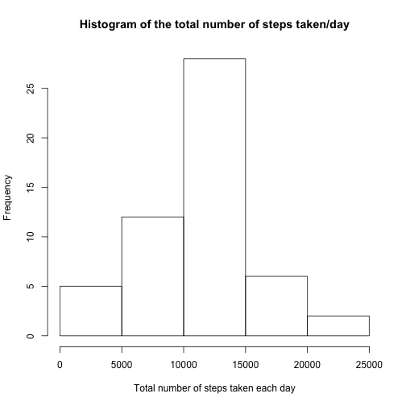
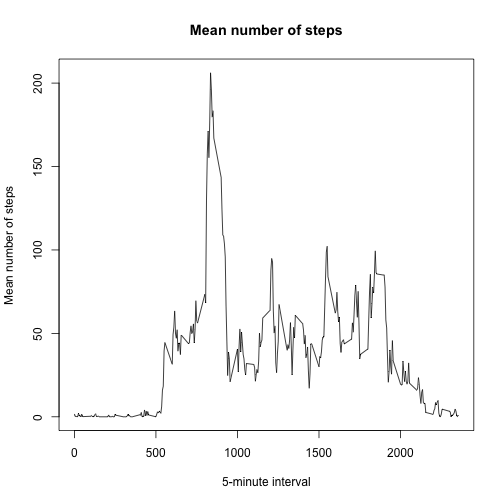
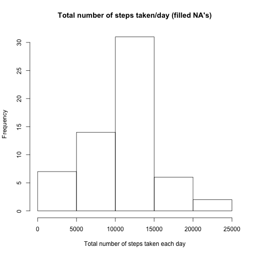
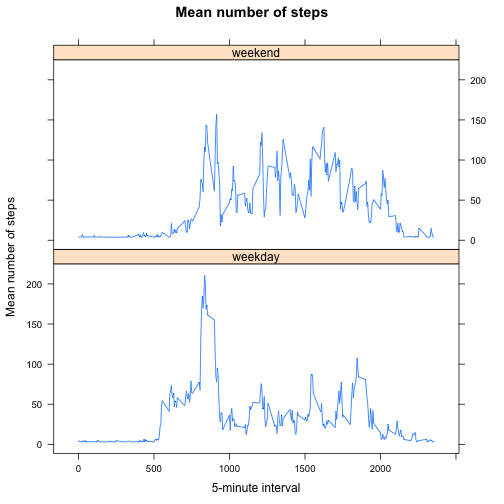

"Reproducible Research: Peer Assessment 1"
==========================================

## Loading and preprocessing the data

```r
setwd("~/Coursera/Reproducible_Research/Week1/RepData_PeerAssessment1")
# load required libraries
library(lattice)
library(knitr)

unzip("activity.zip")
activity <- read.csv("activity.csv")
#str(activity)
#summary(activity)
```
## What is mean total number of steps taken per day?
Calculate the total number of steps taken per day:

```r
sumSteps <- aggregate(steps ~ date, data=activity, FUN=sum)
meanSteps <- aggregate(steps ~ date, data=activity, FUN=mean)
```

## Make a histogram of the total number of steps taken each day

```r
hist(sumSteps$steps,xlab="Total number of steps taken each day", main="Histogram of the total number of steps taken/day")
```



```r
## Copy my plot to a PNG file
dev.copy(png, file = "sumStepsHist.png")
## Don't forget to close the PNG device!
dev.off()
```

## Calculate and report the mean and median of the total number of steps taken per day:

```r
smean <- mean(sumSteps$steps)
smedian <- median(sumSteps$steps)
paste("The mean of the total number of steps taken per day is", as.character(smean))
```

```
## [1] "The mean of the total number of steps taken per day is 10766.1886792453"
```

```r
paste("The median of the total number of steps taken per day is", as.character(smedian))
```

```
## [1] "The median of the total number of steps taken per day is 10765"
```

## What is the average daily activity pattern?
Make a time series plot (i.e. type = "l") of the 5-minute interval (x-axis) and the average number of steps taken, averaged across all days (y-axis)

```r
meanStepsPerInterval <- aggregate(activity$steps, list(interval=activity$interval), FUN = mean, na.rm=TRUE)
names(meanStepsPerInterval) <- c("interval", "meanSteps" )
plot(meanStepsPerInterval$interval, meanStepsPerInterval$meanSteps, type = "l", ,xlab="5-minute interval", ylab="Mean number of steps",  main="Mean number of steps")
```



```r
## Copy my plot to a PNG file
dev.copy(png, file = "meanStepsPerInterval.png")
## Don't forget to close the PNG device!
dev.off()
```

## Which 5-minute interval, on average across all the days in the dataset, contains the maximum number of steps?

```r
rowmax<- which(meanStepsPerInterval$meanSteps==max(meanStepsPerInterval$meanSteps))
paste("The maximum 5-minute intervalaverage across all the days number of steps is", meanStepsPerInterval[rowmax, 1], "with the value of", meanStepsPerInterval[rowmax, 2])
```

```
## [1] "The maximum 5-minute intervalaverage across all the days number of steps is 835 with the value of 206.169811320755"
```

## Imputing missing values
Calculate and report the total number of missing values in the dataset (i.e. the total number of rows with NA's)

```r
missingRow <- activity[is.na(activity$steps),] #df that contains only the NA rows of activity$steps
nrow(missingRow)
```

```
## [1] 2304
```
## Devise a strategy for filling in all of the missing values in the dataset. The strategy does not need to be sophisticated. For example, you could use the mean/median for that day, or the mean for that 5-minute interval, etc.
Using the meanSteps values to fill out the NA values,
Create a new dataset that is equal to the original dataset but with the missing data filled in.

```r
filledActivity <- activity
for (i in 1:nrow(filledActivity)) {
  if (is.na(filledActivity$steps[i])) {
    filledActivity$steps[i] <- meanSteps$steps[filledActivity$date[i]] }}
```
## Make a histogram of the total number of steps taken each day and Calculate and report the mean and median total number of steps taken per day. Do these values differ from the estimates from the first part of the assignment? What is the impact of imputing missing data on the estimates of the total daily number of steps?

```r
filledSumSteps <- aggregate(steps ~ date, data=filledActivity, FUN=sum)

hist(filledSumSteps$steps,xlab="Total number of steps taken each day",main="Total number of steps taken/day (filled NA's)")
```



```r
## Copy my plot to a PNG file
dev.copy(png, file = "filledSumSteps.png")
## Don't forget to close the PNG device!
dev.off()

filledSmean <- mean(filledSumSteps$steps)
filledSmedian <- median(filledSumSteps$steps)
paste("The filledSmean of the total number of steps taken per day is", as.character(filledSmean))
paste("The filledSmedian of the total number of steps taken per day is", as.character(filledSmedian))
```
we can see that there is a slight difference in "filledSumSteps" and "sumSteps", where the first has lower mean and median. More detailed difference can also be observed using the summary func:

```r
summary(filledSumSteps)
```

```
##          date        steps      
##  2012-10-01: 1   Min.   :   41  
##  2012-10-02: 1   1st Qu.: 8704  
##  2012-10-03: 1   Median :10586  
##  2012-10-04: 1   Mean   :10448  
##  2012-10-05: 1   3rd Qu.:12986  
##  2012-10-06: 1   Max.   :21194  
##  (Other)   :54
```
and 

```r
summary(sumSteps)
```

```
##          date        steps      
##  2012-10-02: 1   Min.   :   41  
##  2012-10-03: 1   1st Qu.: 8841  
##  2012-10-04: 1   Median :10765  
##  2012-10-05: 1   Mean   :10766  
##  2012-10-06: 1   3rd Qu.:13294  
##  2012-10-07: 1   Max.   :21194  
##  (Other)   :47
```

## Are there differences in activity patterns between weekdays and weekends?
Create a new factor variable in the dataset with two levels "weekday" and "weekend" indicating whether a given date is a weekday or weekend day.

```r
WeekDay <- factor(weekdays(as.Date(filledActivity$date)) %in% c("Sunday","Saturday"))
levels(WeekDay) <- c("weekday","weekend")
filledActivity <- cbind(filledActivity,WeekDay)
```
## Make a panel plot containing a time series plot (i.e. type = "l") of the 5-minute interval (x-axis) and the average number of steps taken, averaged across all weekday days or weekend days (y-axis). See the README file in the GitHub repository to see an example of what this plot should look like using simulated data.

```r
WeekdayMean <- aggregate(steps ~ interval + WeekDay, data=filledActivity, FUN=mean)
names(WeekdayMean) <- c("interval","WeekDay", "meanSteps")

library(lattice)
xyplot(meanSteps ~ interval | WeekDay, data = WeekdayMean, layout = c(1, 2), type="l", xlab="5-minute interval", ylab="Mean number of steps",  main="Mean number of steps")
```



```r
## Copy my plot to a PNG file
dev.copy(png, file = "WeekdayMean.png")
## Don't forget to close the PNG device!
dev.off()
```
